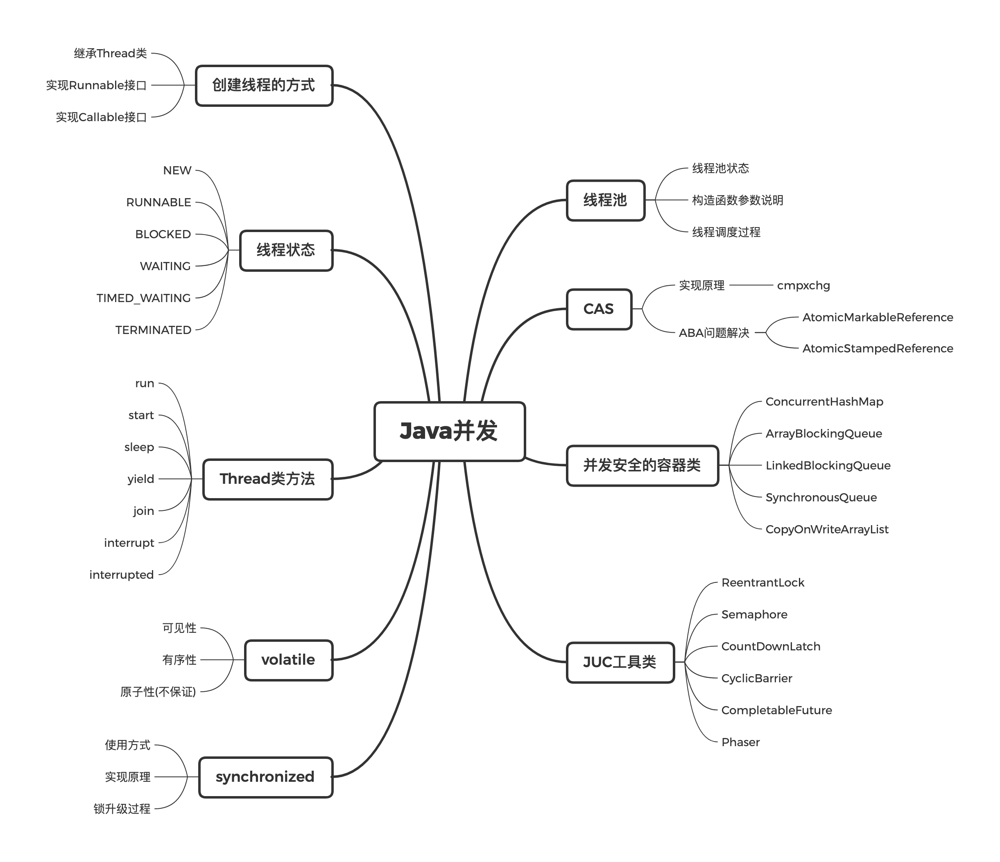

= Week_04
:icons: font
:source-highlighter: highlightjs
:highlightjs-theme: idea
:hardbreaks:
:sectlinks:
:sectnums:
:stem:

== 作业02 启动新线程拿到返回值

=== Future

[source,java]
----
public class Homework03 {

    private static final ExecutorService THREAD_POOL = Executors.newFixedThreadPool(Runtime.getRuntime().availableProcessors());

    public static void main(String[] args) throws Exception {

        long start = System.currentTimeMillis();
        // 在这里创建一个线程或线程池，
        // 异步执行 下面方法

        Future<Integer> future = THREAD_POOL.submit(Homework03::sum);
        // main thread logic...
        int result = future.get(); //这是得到的返回值

        // 确保  拿到result 并输出
        System.out.println("异步计算结果为：" + result);

        System.out.println("使用时间：" + (System.currentTimeMillis() - start) + " ms");

        // 然后退出main线程
        THREAD_POOL.shutdown();
    }

    private static int sum() {
        return fibo(36);
    }

    private static int fibo(int a) {
        if (a < 2)
            return 1;
        return fibo(a - 1) + fibo(a - 2);
    }
}
----

=== CountdownLatch

[source,java]
----
CountDownLatch latch = new CountDownLatch(1);
AtomicInteger resultHolder = new AtomicInteger();
THREAD_POOL.submit(() -> {
    resultHolder.set(sum());
    latch.countDown();
});
// main thread logic...
latch.await();
int result = resultHolder.get(); //这是得到的返回值
----

=== CompletableFuture

[source,java]
----
CompletableFuture<Integer> future = CompletableFuture.supplyAsync(Homework03::sum, THREAD_POOL);
// main thread logic...
int result = future.get(); //这是得到的返回值
----

=== CompletableFuture异步回调

[source,java]
----
CompletableFuture.supplyAsync(Homework03::sum, THREAD_POOL)
   .thenAcceptAsync(result -> {
       // 确保  拿到result 并输出
       System.out.println("异步计算结果为：" + result);
       System.out.println("使用时间：" + (System.currentTimeMillis() - start) + " ms");

   });
// main thread logic...
future.join();
----

== 作业04 并发知识思维导图

